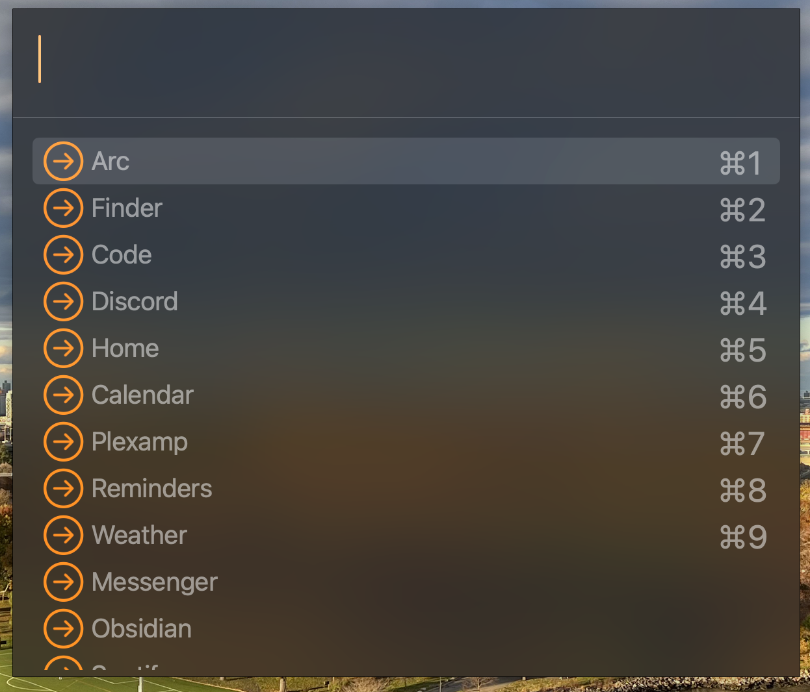

# Lightspot.spoon
Lightspot is a lightweight, consistent, and fast Spotlight replacement.

## App Chooser

Lightspot provides one hotkey, `chooser`, which defaults to `Cmd+Space` which will display a Spotlight-like completion panel:



This works alongside [EnsureApp](https://github.com/adammillerio/EnsureApp.spoon) and [WindowCache](https://github.com/adammillerio/WindowCache.spoon) to provide fast and consistent access to apps. It will display all configured `apps`, with the most recently used ones in the current space prioritized.

# Features

* All apps configured in EnsureApp are shown and filterable as choices
* Most recently used and configured apps in the current space are prioritized
* If no configured app is found, then a Spotlight-like search of applications on the system is performed and an application is ensured in the current space if one is found

# Installation

This Spoon depends on two other Spoons being installed, loaded, and configured:
* [EnsureApp](https://github.com/adammillerio/EnsureApp.spoon).
    * Example app configurations provided below
* [WindowCache](https://github.com/adammillerio/WindowCache.spoon)
    * No configuration needed other than start

## Automated

Lightspot can be automatically installed from my [Spoon Repository](https://github.com/adammillerio/Spoons) via [SpoonInstall](https://www.hammerspoon.org/Spoons/SpoonInstall.html). See the repository README or the SpoonInstall docs for more information.

Example `init.lua` configuration which configures `SpoonInstall` and uses it to install and start WindowCache, EnsureApp, and Lightspot:

```lua
hs.loadSpoon("SpoonInstall")

spoon.SpoonInstall.repos.adammillerio = {
    url = "https://github.com/adammillerio/Spoons",
    desc = "adammillerio Personal Spoon repository",
    branch = "main"
}

spoon.SpoonInstall:andUse("WindowCache", {repo = "adammillerio", start = true})

spoon.SpoonInstall:andUse("EnsureApp", {
    repo = "adammillerio",
    start = true,
    config = {
        apps = {
            ["Discord"] = {app = "Discord", action = "maximize"},
            ["Arc"] = {
                app = "Arc",
                action = "maximize",
                spacePrecedence = true,
                newWindowConfig = {
                    menuSection = "File",
                    menuItem = "New Window"
                }
            }
        }
    }
})

spoon.SpoonInstall:andUse("Lightspot", {start = true, hotkeys = "default"})
```

This will bind the Lightspot Chooser to Cmd+Space. 

When displayed, it will show the two configured apps from `EnsureApps`:

* Discord opens the "Discord" application and maximizes it in the current Space
* Arc opens a Space-specific instance of the "Arc" application in the current space, using the provided newWindowConfig to identify an application menu selection

Any other query will attempt a Spotlight-like search for a matching application, which will be opened or moved to the current Space and focused.

## Manual

Download the latest WindowCache release from [here.](https://github.com/adammillerio/Spoons/raw/main/Spoons/WindowCache.spoon.zip)

Download the latest EnsureApp release from [here.](https://github.com/adammillerio/Spoons/raw/main/Spoons/EnsureApp.spoon.zip)

Download the latest Lightspot release from [here.](https://github.com/adammillerio/Spoons/raw/main/Spoons/Lightspot.spoon.zip)

Unzip them all and either double click to load the Spoons or place the contents manually in `~/.hammerspoon/Spoons`

Then load the Spoons in `~/.hammerspoon/init.lua`:

```lua
hs.loadSpoon("WindowCache")

hs.spoons.use("WindowCache", {start = true})

hs.loadSpoon("EnsureApp")

hs.spoons.use("EnsureApp", {
    config = {
        apps = {
            ["Discord"] = {app = "Discord", action = "maximize"},
            ["Arc"] = {
                app = "Arc",
                action = "maximize",
                spacePrecedence = true,
                newWindowConfig = {
                    menuSection = "File",
                    menuItem = "New Window"
                }
            }
        }
    },
    start = true
})

hs.loadSpoon("Lightspot")

hs.spoons.use("Lightspot", {start = true})

spoon.Lightspot:bindHotkeys({choose = {{"cmd"}, "space"}})
```

# Usage

Refer to the [hosted documentation](https://adammiller.io/Spoons/Spacer.html) additional for information on usage.
